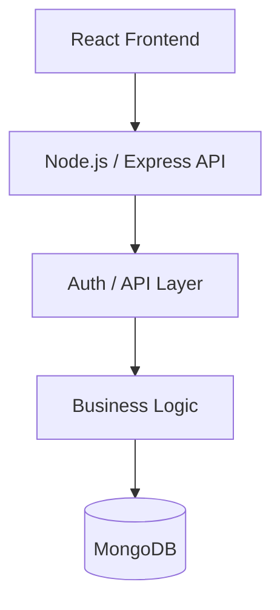
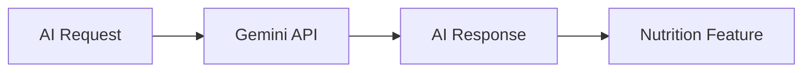

# NutriHub

## Overview

NutriHub is a nutrition and calorie tracking application built with a React frontend and a Node.js/Express backend. It includes user authentication, BMR/TDEE-based planning, local nutrition tracking, and an optional Gemini-powered meal generation flow.

## Features

- User signup and login with JWT-based auth
- BMR/TDEE calculation and calorie planning
- Local meal and ingredient tracking in the browser
- AI-powered meal plan generation when Gemini is configured
- MongoDB-ready backend models and route structure
- Developer health checks and automated tests

## Architecture





## Tech Stack

- Node.js
- Express
- MongoDB + Mongoose
- JWT + bcrypt
- React + Vite
- Google Gemini API
- Jest + Supertest
- Vitest + Testing Library
- Docker + Docker Compose

## Project Structure

```text
NutriHub/
├── backend/
│   ├── __tests__
│   ├── config/
│   ├── controllers/
│   ├── middleware/
│   ├── models/
│   ├── routes/
│   ├── scripts/
│   ├── utils/
│   ├── .env.example
│   ├── jest.config.js
│   ├── package.json
│   ├── server.js
│   └── ...
├── frontend/frontend
│   ├── src/
│   ├── package.json
│   ├── vite.config.js
│   └── ...
├── docs/
├── scripts/
├── package.json
├── README.md
├── .gitignore
├── Dockerfile
├── docker-compose.yml
├── .dockerignore
├── .github/workflows/ci.yml
└── ...
```

## Local Development

### Prerequisites

- Node.js 18+
- npm
- MongoDB connection string (optional for local demo mode)
- Gemini API key (optional for AI features)

### Backend

```bash
cd backend
cp .env.example .env
npm install
npm run dev
```

### Frontend

```bash
cd frontend/frontend
npm install
npm run dev
```

## Docker Setup

```bash
cp backend/.env.example backend/.env
# fill in required values

docker compose up --build
```

## Environment Variables

```env
PORT=5000
MONGO_URI=mongodb://mongo:27017/nutrihub
JWT_SECRET=change_me
GEMINI_API_KEY=your_gemini_key
```

## API Documentation

### Auth

- `POST /api/auth/signup`
- `POST /api/auth/login`

### Food

- `GET /api/food/search?q=banana`

### Meals

- `POST /api/meals`
- `GET /api/meals`

### Recipes

- `POST /api/recipes/generate`

### AI

- `POST /generate-meal`

## Authentication

Protected endpoints require a bearer token in the `Authorization` header.

## AI/Gemini Integration

Gemini is optional; when `GEMINI_API_KEY` is missing, the app keeps running and returns a graceful error for the AI endpoints instead of crashing unrelated features.

## Testing

### Backend

```bash
cd backend
npm test
npm run test:coverage
```

### Frontend

```bash
cd frontend/frontend
npm test
npm run test:coverage
```

## Test Coverage

Coverage reports are generated by the test toolchains and documented in `docs/COVERAGE.md`.

## CI/CD

The GitHub Actions workflow in `.github/workflows/ci.yml` installs dependencies, runs tests, generates coverage, and builds the frontend.

## Security

- password hashing with bcrypt
- JWT validation for protected routes
- no secrets in source files
- centralized API error responses without stack traces in production

## Developer Setup

```bash
npm install --prefix backend
npm install --prefix frontend/frontend
node ./scripts/doctor.js
```

## Troubleshooting

- Missing JWT secret: configure it in `backend/.env`
- Missing Mongo config: the app will start in degraded mode
- Missing Gemini key: AI routes fail gracefully

## Future Improvements

- expand route-level tests
- add schema validation
- improve AI response parsing and retry handling
- add a stronger production deployment setup
